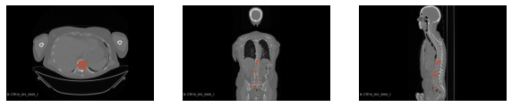

# About
Osteolytic lesions are small, heterogeneous and can grow outside of bones. Hence, it is difficult to train an object segmentation model directly on CT scans.
Moreau et al. (2020) proposed segmenting bone tissue first to improve lesion segmentation performance. However, it only imrpoves performance on PET/CT instead
of only CT scans. An idea that could solve this problem is to localize potential lesions prior to segmentation. The traditional method that follows this idea is Mask R-CNN, which utilizes
a Region Proposal Network (RPN) to localise potential regions before segmenting. In this project I propose DetSeg, an architecture
that utilizes an object detection model to localize lesions before segmenting them with an object segmentation model. Specifically, Yolov5 + 2D U-Net are 
used in this project. Mask R-CNN is also implemented for comparison. The data is provided by Elisabeth-TweeSteden Ziekenhuis (ETZ) hospital in Tilburg, the Netherlands.
This project is a part of the "Implementation of an optimized AI model for the detection and monitoring of osteolytic bone lesions" - a WeCare collaboration project between Tilburg University and ETZ hospital
# Dataset
The CT scans used in this thesis belong to Elizabeth-TweeSteden Hospital (ETZ) in Tilburg, Netherlands. The patients in each scan are 18 years or
older. There are 96 full-body CT scans from 79 patients acquired by various scanners, each with a maximum of 20 lesions. The scans are DICOM
images with a resolution of either 768 x 768 or 512 x 512 pixels, which are then combined to make 3D axial slices. 

# Pre-processing and Data Transformation
# Models
## DetSeg
## Mask R-CNN
# Results
## Lesion detection
## Lesion segmentation
## Speed benchmark
# References
# License
# Contact

